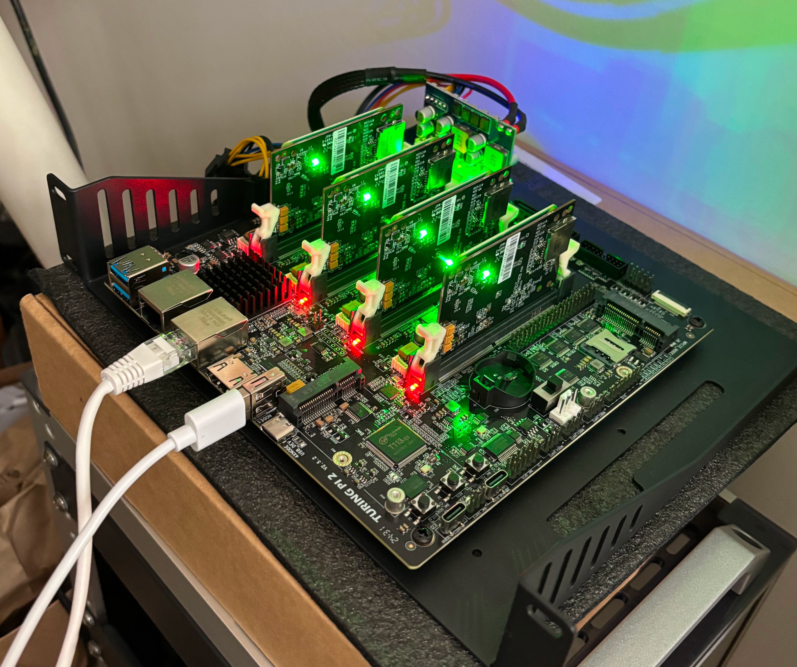

# PiCluster

PiCluster is a fully automated, self-hosted Kubernetes media server stack designed for Raspberry Pi clusters. Built on a Turing Pi 2.5 carrier board with four Raspberry Pi Compute Module 4 nodes.

This project provides manifests and configuration for running Jellyfin, Sonarr, Radarr, Transmission (with VPN), Jackett, and a modern dashboard—all orchestrated by K3s and backed by shared NFS storage. PiCluster is ideal for homelab enthusiasts, edge computing, and anyone seeking a robust, private alternative to cloud-based media solutions.

---

<p align="center">
  
</p>

## 📑 Index

- [Hardware Setup](#hardware-setup)
- [Kubernetes Installation (K3s)](#kubernetes-installation-k3s)
- [Storage Configuration (NFS)](#storage-configuration-nfs)
- [Remote Access Setup](#remote-access-setup)
- [Media Server Applications](#media-server-applications)
  - [Application Stack Overview](#application-stack-overview)
  - [Detailed Application Information](#detailed-application-information)
  - [Storage Architecture](#storage-architecture)
  - [Network Configuration](#network-configuration)
  - [Deployment and Management](#deployment-and-management)
  - [Security Features](#security-features)
  - [Integration Workflow](#integration-workflow)

---

## Hardware Setup

### Requirements
- Turing Pi 2.5 carrier board
- 4x Raspberry Pi Compute Module 4 (with eMMC)
- Micro SD card (for OS images)
- Network connection to your LAN

### Node Configuration
| Node | Role | IP Address | Hostname |
|------|------|------------|----------|
| Node 1 | Worker | 192.168.88.167 | node01 |
| Node 2 | Worker | 192.168.88.164 | node02 |
| Node 3 | Control Plane | 192.168.88.163 | node03 |
| Node 4 | Worker | 192.168.88.162 | node04 |

## Flash the eMMC on the Raspberry Pi Compute Module 4 and Configure the Nodes
### Step 1: Prepare the OS Image
1. Download the latest Raspberry Pi OS Lite (64-bit) image from the [official website](https://www.raspberrypi.com/software/operating-systems/#raspberry-pi-os-64-bit)
2. Copy the image to the `images/` folder on your micro SD card
3. Insert the micro SD card into the slot on the back of your Turing Pi carrier board

### Step 2: Access the Turing Pi Management Interface
Log into your Turing Pi carrier board (default password is `turing`):
```bash
ssh root@turingpi.local
```
### Step 3: Flash Each Compute Module
Flash the OS image to the eMMC on each Raspberry Pi Compute Module 4 (repeat for nodes 1-4):
```bash
tpi flash -n 1 -l -i /mnt/sdcard/images/2024-11-19-raspios-bookworm-arm64-lite.img
```
### Step 4: Configure Boot Settings
Mount the eMMC to modify boot configuration:
```bash
tpi advanced msd --node 1
mount /dev/sda1 /mnt/bootfs
```
Enable UART logging for boot diagnostics:
```bash
echo "enable_uart=1" >> /mnt/bootfs/config.txt
```

Enable SSH server:
```bash
touch /mnt/bootfs/ssh
```

Create default user account (username: `pi`, password: `raspberry`):
```bash
echo 'pi:$6$c70VpvPsVNCG0YR5$l5vWWLsLko9Kj65gcQ8qvMkuOoRkEagI90qi3F/Y7rm8eNYZHW8CY6BOIKwMH7a3YYzZYL90zf304cAHLFaZE0' > /mnt/bootfs/userconf
```

Enable memory cgroups for Kubernetes (append to existing cmdline.txt):
```bash
sed -i '$ s/$/ cgroup_memory=1 cgroup_enable=memory/' /mnt/bootfs/cmdline.txt
```

Unmount and restart the node:
```bash
umount /mnt/bootfs
tpi power -n 1 off
tpi power -n 1 on
```

Monitor boot process:
```bash
tpi uart get -n 1
```

**Repeat steps 3-4 for all four Compute Module nodes.**

### Step 5: Configure Network and Hostnames
After all nodes have booted, SSH into each node and configure networking.

Add all node IP addresses to `/etc/hosts` on each Compute Module:
```
127.0.0.1      localhost
192.168.88.167 node01 node01.local
192.168.88.164 node02 node02.local
192.168.88.163 node03 node03.local
192.168.88.162 node04 node04.local
```

Set the appropriate hostname on each node:
```bash
# On node01 (192.168.88.167)
hostnamectl set-hostname node01

# On node02 (192.168.88.164)
hostnamectl set-hostname node02

# On node03 (192.168.88.163) - Control Plane
hostnamectl set-hostname node03

# On node04 (192.168.88.162)
hostnamectl set-hostname node04
```

Update package lists and install essential tools:
```bash
sudo apt update && sudo apt upgrade -y
sudo apt install -y curl wget vim htop
```
## Kubernetes Installation (K3s)

### Overview
This cluster uses K3s, a lightweight Kubernetes distribution optimized for edge computing and IoT devices.

**Technology Stack:**
- **K3s**: https://docs.k3s.io/
- **Kube-VIP**: https://kube-vip.io/ (for load balancing)
- **k3sup**: https://github.com/alexellis/k3sup (optional deployment tool)

### Step 1: Initialize the Control Plane Node
On the control plane node (node03 - 192.168.88.163):
```bash
curl -sfL https://get.k3s.io | sh -s - \
  --write-kubeconfig-mode 644 \
  --node-ip 192.168.88.163 \
  --disable local-storage \
  --data-dir /mnt/k3s-data
```

**Installation Options Explained:**
- `--write-kubeconfig-mode 644`: Makes kubeconfig readable by non-root users
- `--node-ip`: Specifies the node's IP address for cluster communication
- `--disable local-storage`: Disables default local storage (we'll use NFS)
- `--data-dir`: Custom data directory for K3s files

Retrieve the cluster join token:
```bash
cat /mnt/k3s-data/server/node-token
```

Verify control plane is running:
```bash
kubectl get nodes
kubectl get pods --all-namespaces
```

### Step 2: Join Worker Nodes to the Cluster
On each worker node (node01, node02, node04), run:
```bash
curl -sfL https://get.k3s.io | K3S_URL=https://192.168.88.163:6443 K3S_TOKEN=<TOKEN_FROM_STEP_1> sh -
```

### Step 3: Label Worker Nodes
From the control plane node, label all worker nodes:
```bash
kubectl label node node01 node-role.kubernetes.io/worker=worker
kubectl label node node02 node-role.kubernetes.io/worker=worker
kubectl label node node04 node-role.kubernetes.io/worker=worker
```

Verify cluster status:
```bash
kubectl get nodes -o wide
```

Expected output:
```
NAME     STATUS   ROLES                  AGE   VERSION        INTERNAL-IP      EXTERNAL-IP   OS-IMAGE
node01   Ready    worker                 1m    v1.31.5+k3s1   192.168.88.167   <none>        Debian GNU/Linux 12 (bookworm)
node02   Ready    worker                 1m    v1.31.5+k3s1   192.168.88.164   <none>        Debian GNU/Linux 12 (bookworm)
node03   Ready    control-plane,master   5m    v1.31.5+k3s1   192.168.88.163   <none>        Debian GNU/Linux 12 (bookworm)
node04   Ready    worker                 1m    v1.31.5+k3s1   192.168.88.162   <none>        Debian GNU/Linux 12 (bookworm)
```
## Storage Configuration (NFS)

### Step 1: Install NFS Server
On the control plane node (node03), install and configure NFS:
```bash
sudo apt install nfs-kernel-server -y
```

### Step 2: Create Storage Directory Structure
Create the directory structure for media server data:
```bash
sudo mkdir -p /mnt/storage/{homer,jellyfin,transmission,sonarr,radarr,jackett}/{config,data}
sudo mkdir -p /mnt/storage/{downloads,media/{movies,tv,music}}
sudo chown -R 1000:1000 /mnt/storage
sudo chmod -R 755 /mnt/storage
```

### Step 3: Configure NFS Exports
Add the following line to `/etc/exports`:
```bash
echo "/mnt/storage       192.168.88.0/24(rw,sync,no_subtree_check,no_root_squash)" | sudo tee -a /etc/exports
```

Apply the NFS configuration:
```bash
sudo exportfs -ra
sudo systemctl enable nfs-kernel-server
sudo systemctl restart nfs-kernel-server
```

### Step 4: Install NFS Client on Worker Nodes
On all worker nodes, install NFS client utilities:
```bash
sudo apt install nfs-common -y
```

Test NFS mount from a worker node:
```bash
sudo mkdir -p /tmp/nfs-test
sudo mount -t nfs 192.168.88.163:/mnt/storage /tmp/nfs-test
ls -la /tmp/nfs-test
sudo umount /tmp/nfs-test
```

## Remote Access Setup

### Copy Kubernetes Configuration
To manage the cluster from your local machine, copy the kubeconfig:

```bash
# From your local machine
scp pi@192.168.88.163:/etc/rancher/k3s/k3s.yaml ~/.kube/config-picluster

# Update server endpoint in the config
sed -i 's/127.0.0.1/192.168.88.163/g' ~/.kube/config-picluster

# Set KUBECONFIG environment variable
export KUBECONFIG=~/.kube/config-picluster

# Test connectivity
kubectl get nodes
```

## Media Server Applications

This K3s cluster hosts a complete media server stack with automated content management and VPN-protected downloads. All applications are deployed using Kubernetes manifests located in the `apps/` directory.

### Application Stack Overview

| Application | Purpose | Access URL | Service Type | Docs |
|-------------|---------|------------|--------------|------|
| **Homer** | Dashboard & Service Directory | `http://192.168.88.163:30080` | NodePort | [Homer README](apps/homer/README.md) |
| **Jellyfin** | Media Server & Streaming | `http://192.168.88.163:8096` | LoadBalancer | [Jellyfin README](apps/jellyfin/README.md) |
| **Transmission** | BitTorrent Client (VPN Protected) | `http://192.168.88.163:9091` | LoadBalancer | [Transmission README](apps/transmission/README.md) |
| **Sonarr** | TV Series Management | `http://192.168.88.163:8989` | LoadBalancer | [Sonarr README](apps/sonarr/README.md) |
| **Radarr** | Movie Management | `http://192.168.88.163:7878` | LoadBalancer | [Radarr README](apps/radarr/README.md) |
| **Jackett** | Torrent Indexer Proxy | `http://192.168.88.163:9117` | LoadBalancer | |
| **K8s Dashboard** | Kubernetes Management UI | `http://192.168.88.163:30443` | NodePort | [Kubernetes Dashboard README](apps/kubernetes-dashboard/README.md) |

### Detailed Application Information

#### 🏠 Homer - Service Dashboard
- **Namespace**: `homer`
- **Description**: Centralized dashboard providing easy access to all media server services
- **Features**: Service status monitoring, custom themes, organized service tiles
- **Configuration**: Mounted via NFS from `/mnt/storage/homer/config`
- **More info**: [apps/homer/README.md](apps/homer/README.md)

#### 🎬 Jellyfin - Media Server
- **Namespace**: `jellyfin`
- **Description**: Open-source media server for streaming movies, TV shows, and music
- **Features**:
  - Hardware transcoding support
  - Multiple client support (web, mobile, TV apps)
  - User management and content libraries
  - DLNA/UPnP support for local network streaming
- **Storage**:
  - Config: `/mnt/storage/jellyfin/config`
  - Media: `/mnt/storage/media` (shared with other apps)
- **Ports**: 8096 (HTTP), 8920 (HTTPS), 1900 (DLNA), 7359 (Discovery)
- **More info**: [apps/jellyfin/README.md](apps/jellyfin/README.md)

#### 🔒 Transmission - Torrent Client (VPN Protected)
- **Namespace**: `downloads`
- **Description**: BitTorrent client with integrated VPN protection via Gluetun
- **Features**:
  - WireGuard integration with kill-switch
  - Automatic VPN health monitoring
  - Firewall protection (only VPN traffic allowed)
  - Custom DNS server for enhanced privacy
  - Public IP verification and logging
- **VPN Status**: Automatically monitored with health checks
- **Storage**:
  - Config: `/mnt/storage/transmission/config`
  - Downloads: `/mnt/storage/shared/downloads` (shared with *arr apps)
- **More info**: [apps/transmission/README.md](apps/transmission/README.md)

#### 📺 Sonarr - TV Series Management
- **Namespace**: `downloads`
- **Description**: Automated TV series collection and management
- **Features**:
  - Automatic episode monitoring and downloading
  - Integration with Transmission and Jackett
  - Metadata and artwork management
  - Episode renaming and organization
- **Storage**:
  - Config: `/mnt/storage/sonarr/config`
  - TV Shows: `/mnt/storage/jellyfin/media/tv-shows`
  - Downloads: `/mnt/storage/shared/downloads` (shared)
- **More info**: [apps/sonarr/README.md](apps/sonarr/README.md)

#### 🎭 Radarr - Movie Management
- **Namespace**: `downloads`
- **Description**: Automated movie collection and management
- **Features**:
  - Automatic movie monitoring and downloading
  - Integration with Transmission and Jackett
  - Quality profiles and release management
  - Movie metadata and artwork
- **Storage**:
  - Config: `/mnt/storage/radarr/config`
  - Movies: `/mnt/storage/jellyfin/media/movies`
  - Downloads: `/mnt/storage/shared/downloads` (shared)
- **More info**: [apps/radarr/README.md](apps/radarr/README.md)

#### 🔍 Jackett - Indexer Proxy
- **Namespace**: `jackett`
- **Description**: Proxy server for torrent trackers, providing unified API for Sonarr/Radarr
- **Features**:
  - Support for 500+ torrent trackers
  - Unified search API for *arr applications
  - Automatic tracker health monitoring
- **Storage**: Config: `/mnt/storage/jackett/config`

#### ⚙️ Kubernetes Dashboard
- **Namespace**: `kubernetes-dashboard`
- **Description**: Web-based Kubernetes cluster management interface
- **Features**:
  - Resource monitoring and management
  - Pod logs and terminal access
  - Deployment scaling and updates
  - Service and ingress management
- **More info**: [apps/kubernetes-dashboard/README.md](apps/kubernetes-dashboard/README.md)

### Storage Architecture

The media server uses NFS-based persistent storage with the following structure:

```
/mnt/storage/
├── homer/config/          # Homer dashboard configuration
├── jellyfin/config/       # Jellyfin server settings and database
├── transmission/config/   # Transmission and VPN configuration
├── sonarr/config/         # Sonarr application data
├── radarr/config/         # Radarr application data
├── jackett/config/        # Jackett indexer configurations
├── shared/downloads/      # Shared download directory (Transmission, Sonarr, Radarr)
└── jellyfin/media/
    ├── movies/            # Organized movie library (Radarr → Jellyfin)
    ├── tv-shows/          # Organized TV show library (Sonarr → Jellyfin)
    └── music/             # Music library (manual/future automation)
```

For more details on storage and shared PVCs, see [downloads-storage/README.md](apps/downloads-storage/README.md).

### Network Configuration

- **Load Balancer**: Uses K3s built-in load balancer with VIP spanning all nodes
- **VPN Protection**: Transmission pod routes all traffic through WireGuard tunnel
- **NodePort Services**: Direct node access for core services (Homer, Jellyfin, Dashboard)
- **Internal Communication**: Apps communicate via Kubernetes service discovery

### Deployment and Management

#### Deploy All Applications
```bash
# Deploy core infrastructure
kubectl apply -f apps/shared-storage/

# Deploy applications (order matters for dependencies)
kubectl apply -f apps/jellyfin/
kubectl apply -f apps/jackett/
kubectl apply -f apps/transmission/
kubectl apply -f apps/sonarr/
kubectl apply -f apps/radarr/
kubectl apply -f apps/homer/
kubectl apply -f apps/kubernetes-dashboard/
```


#### Check Application Status
```bash
# View all media server pods
kubectl get pods --all-namespaces | grep -E "(homer|jellyfin|transmission|sonarr|radarr|jackett)"

# Check persistent volumes
kubectl get pv
```

#### Access Logs
```bash
# Transmission VPN logs
kubectl logs -n transmission deployment/transmission-vpn -c gluetun

# Application logs
kubectl logs -n jellyfin deployment/jellyfin
kubectl logs -n sonarr deployment/sonarr
kubectl logs -n radarr deployment/radarr
```

### Security Features

1. **VPN Protection**: All torrent traffic routed through encrypted WireGuard tunnel
2. **Network Isolation**: Applications isolated in separate namespaces
3. **Firewall Rules**: Gluetun enforces strict firewall allowing only VPN traffic
4. **Private Networking**: Internal service communication over cluster network
5. **Health Monitoring**: Automatic VPN health checks with connection recovery

### Integration Workflow

The applications work together in an automated content acquisition pipeline:

1. **Content Request**: User adds movie/show to Radarr/Sonarr
2. **Search**: Radarr/Sonarr queries Jackett for available releases
3. **Download**: Best release sent to Transmission (via VPN) for download
4. **Processing**: Completed downloads moved and renamed by Radarr/Sonarr
5. **Library Update**: Jellyfin automatically detects new content
6. **Streaming**: Content available for streaming through Jellyfin

This setup provides a fully automated, secure, and scalable media server solution running on Kubernetes.

---
